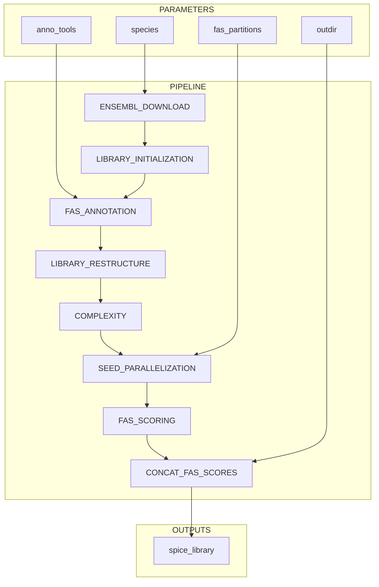

# BIONF/spice_library_pipeline

## Acknowledgements & Original Software

This pipeline includes adaptations from the **Splicing-based Protein Isoform Comparison Estimator (SPICE)** tool, originally developed by [Christian Blümel](https://github.com/chrisbluemel) and [Julian Dosch](https://github.com/JuRuDo).
The original SPICE implementation is available at [https://github.com/chrisbluemel/SPICE](https://github.com/chrisbluemel/SPICE) and is licensed under the [GNU General Public License v3.0](https://www.gnu.org/licenses/gpl-3.0.en.html).

## Introduction

This repository contains a Nextflow-based pipeline to automate the creation of SPICE libraries.
Instead of running multiple scripts manually, you can now use this streamlined pipeline.



It is roughly divided into the following steps:

The pipeline is roughly divided into the following steps:

- Download peptide sequences and annotation files and fetch species metadata from [ENSEMBL](https://www.ensembl.org/index.html) for the target organism.
- Initialize the SPICE library structure [ENSEMBL](https://www.ensembl.org/index.html).
- Annotate the peptide sequences using [fas.doAnno](https://doi.org/10.1093/bioinformatics/btad226).
- Restructure the annotated sequences in preparation for FAS scoring.
- Order FAS scoring by estimating run time for each protein pairing by using [fas.calcComplexity](https://doi.org/10.1093/bioinformatics/btad226).
- Group protein pairings into a user specified amount of partitions to reduce the amount of processes (optional).
- Perform FAS scoring using [fas.run](https://doi.org/10.1093/bioinformatics/btad226).
- Merge the resulting FAS scores into the final library structure.
- Emit the created library in to the target directory

## Usage

Below is the general installation/setup/usage explanation. A detailed explanation and further assistance can be found in the [WIKI](https://github.com/felixhaidle/spice-nf/wiki)

> [!NOTE]
> If you are from AK Ebersberger please refer to the [AKE usage documentation](https://github.com/felixhaidle/spice-nf/wiki/02_1-Usage-AKE).

### Install FAS

SPICE heavily relies on **FAS** to function, as the FAS algorithm estimates transcript (dis)similarities.

FAS itself depends on various annotation tools, which cannot be bundled with this pipeline.
You must first follow the instructions [here](https://github.com/BIONF/FAS) to set it up.

Make sure the following command runs successfully in the environment where you will execute the pipeline (e.g., when submitting a job via SLURM):

```bash
fas.doAnno -i test_annofas.fa -o test_output
```

### Set up the pipeline

> [!NOTE]
> If you are new to Nextflow and nf-core, please refer to [this page](https://nf-co.re/docs/usage/installation) for instructions on setting up Nextflow.
> Make sure to [test your setup](https://nf-co.re/docs/usage/introduction#how-to-run-a-pipeline) using `-profile test` before running the workflow on actual data.

You should test the functionality using the test profile.

> [!WARNING]
> This pipeline currently only supports the "conda" profile. The environment requirements are defined in `assets/environment.yml`. All processes use the same environment.

```bash
nextflow run git@github.com:felixhaidle/spice-nf.git \
  -r <DESIRED_RELEASE>
  -profile conda,test \
  --outdir <OUTDIR>
```

### Run the full pipeline:

```bash
nextflow run git@github.com:felixhaidle/spice-nf.git \
  -r <DESIRED_RELEASE>
  -profile conda \
  --species <SPECIES> \
  --anno_tools <PATH_TO_ANNOTOOLS_INSTALLATION> \
  --outdir <OUTDIR> \
  --fas_partitions <AVAILABLE_CPUS>
```

| Parameter          | Description                                                                                                                                                                                                                                                                                                                                                                                                                             |
| ------------------ | --------------------------------------------------------------------------------------------------------------------------------------------------------------------------------------------------------------------------------------------------------------------------------------------------------------------------------------------------------------------------------------------------------------------------------------- |
| `-r`               | specifies the pipeline version                                                                                                                                                                                                                                                                                                                                                                                                          |
| `-profile conda`   | Specifies the execution profile (only `conda` is supported).                                                                                                                                                                                                                                                                                                                                                                            |
| `--species`        | Species name (e.g., `homo_sapiens`, `mus_musculus`). Must match ENSEMBL naming.                                                                                                                                                                                                                                                                                                                                                         |
| `--anno_tools`     | Path to the installed annotation tools directory (equivalent to the `-t` parameter in `fas.setup`).                                                                                                                                                                                                                                                                                                                                     |
| `--outdir`         | Output directory for pipeline results. Will be created if it doesn't exist.                                                                                                                                                                                                                                                                                                                                                             |
| `--fas_partitions` | Amount of parallel fas scoring processes you can run in parallel. Will group the protein pairs into this amout of processes. Higher amount means more parallel scoring, but if the processes can't run in parallel the benefits diminishes. This parameter is optional buth highly highly highly recommended to be spcified since otherweise for each protein pairing a process will be created, which significantly increases runtime. |

A full overview of all available parameters can be found in [`parameters.md`](docs/parameters.md). Check it out before you run the pipeline.

> [!WARNING]
> Please provide pipeline parameters via the CLI or the Nextflow `-params-file` option.
> Custom config files (via the `-c` option) can be used for configuration **except for parameters**; see [docs](https://nf-co.re/docs/usage/getting_started/configuration#custom-configuration-files).

A full list of available parameters and documentation can also be found in the **[WIKI](https://github.com/felixhaidle/spice-nf/wiki)**.

## Credits

`BIONF/spice_library_pipeline` was originally written by **Felix Haidle**.

[Become a contributor](https://github.com/felixhaidle/spice-nf/wiki/06-Contributing)

## AI Assistance Acknowledgment

Parts of this project’s documentation, code structuring, and scripting were developed with the assistance of AI (ChatGPT by OpenAI).
All final decisions, modifications, and validations were made by the project author(s).

## Citations

<!-- TODO nf-core: Add citation for pipeline after first release. Uncomment lines below and update Zenodo doi and badge at the top of this file. -->
<!-- If you use BIONF/spice_library_pipeline for your analysis, please cite it using the following doi: [10.5281/zenodo.XXXXXX](https://doi.org/10.5281/zenodo.XXXXXX) -->

<!-- TODO nf-core: Add bibliography of tools and data used in your pipeline -->

An extensive list of references for the tools used by the pipeline can be found in [`CITATIONS.md`](CITATIONS.md).

This pipeline uses code and infrastructure developed and maintained by the [nf-core](https://nf-co.re) community, reused here under the [MIT license](https://github.com/nf-core/tools/blob/main/LICENSE).

> **The nf-core framework for community-curated bioinformatics pipelines.**
> Philip Ewels, Alexander Peltzer, Sven Fillinger, Harshil Patel, Johannes Alneberg, Andreas Wilm, Maxime Ulysse Garcia, Paolo Di Tommaso & Sven Nahnsen.
> _Nat Biotechnol._ 2020 Feb 13. doi: [10.1038/s41587-020-0439-x](https://dx.doi.org/10.1038/s41587-020-0439-x).
